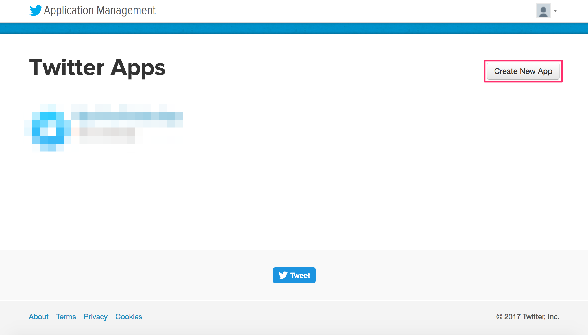
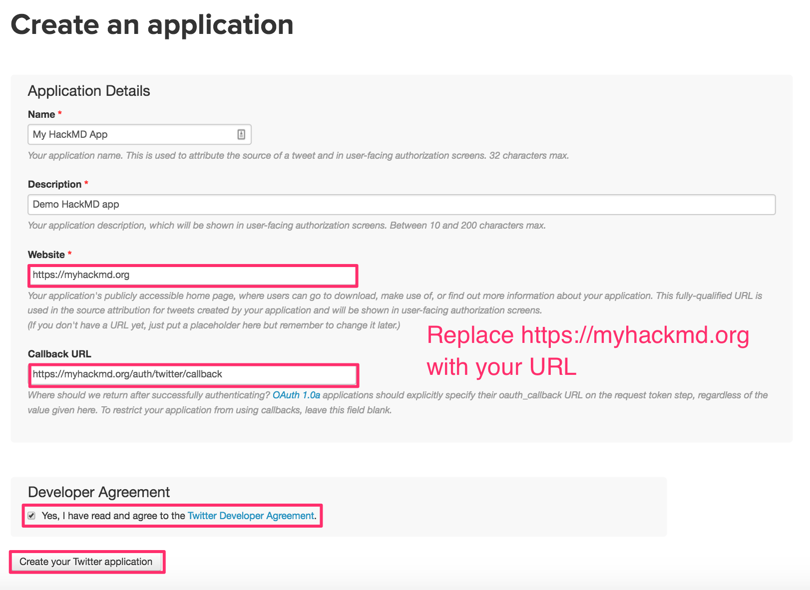
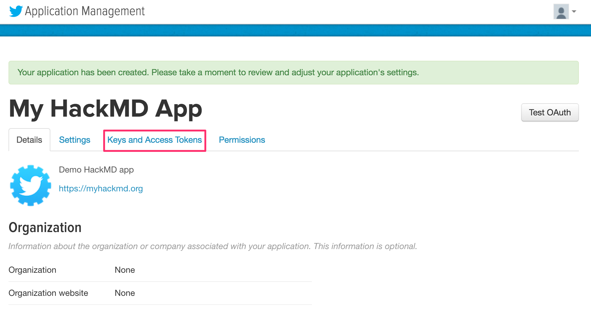
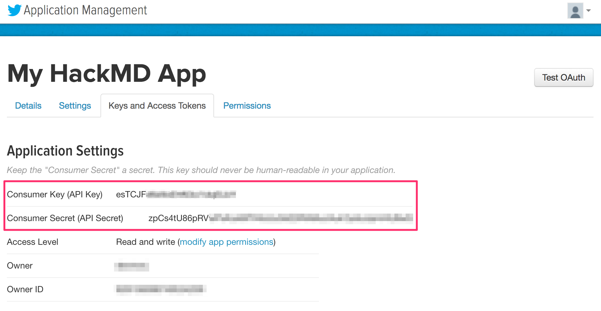
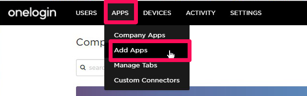
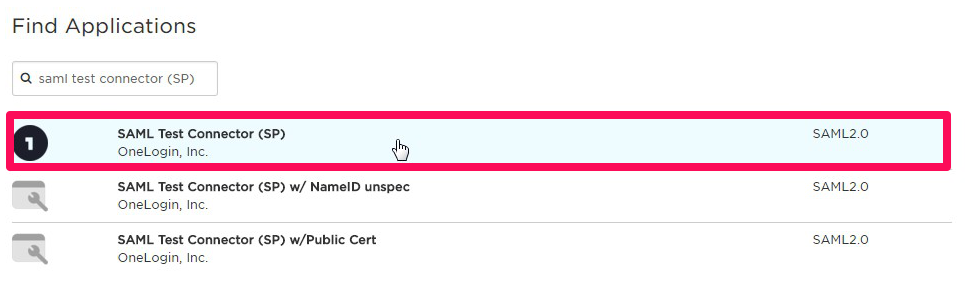
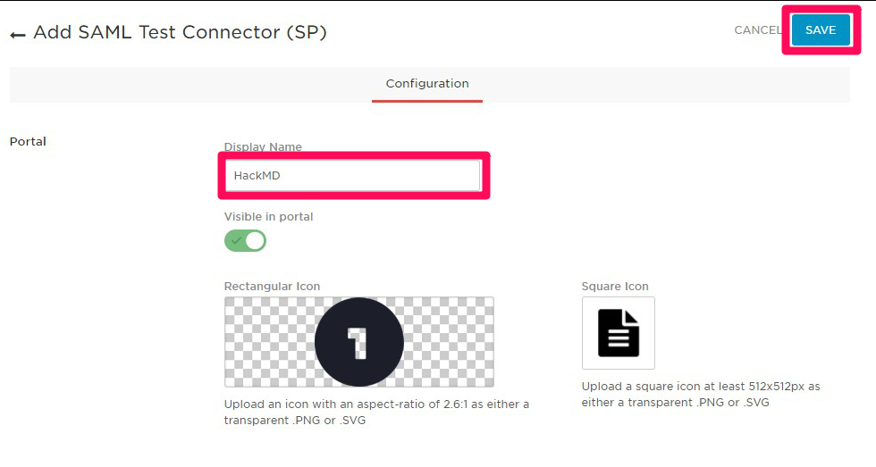
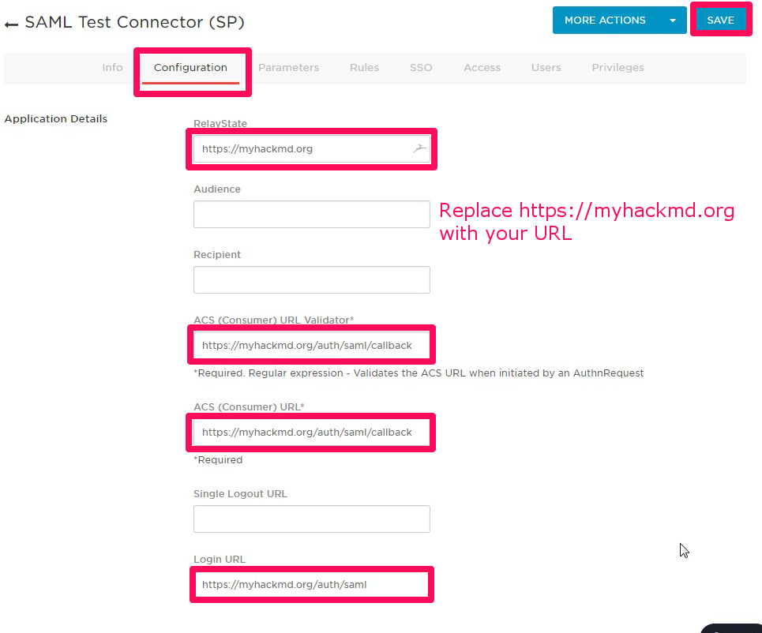
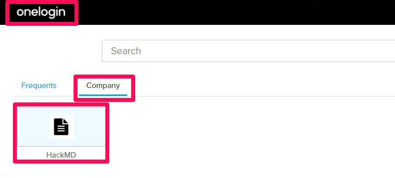

# Guide - Authentication

### Twitter
1. Sign-in or sign-up for a Twitter account
2. Go to the Twitter Application management page [here](https://apps.twitter.com/)
3. Click on the **Create New App** button to create a new Twitter app:



4. Fill out the create application form, check the developer agreement box, and click **Create Your Twitter Application**



*Note: you may have to register your phone number with Twitter to create a Twitter application*

To do this Click your profile icon --> Settings and privacy --> Mobile  --> Select Country/region --> Enter phone number --> Click Continue

5. After you receive confirmation that the Twitter application was created, click **Keys and Access Tokens**



6. Obtain your Twitter Consumer Key and Consumer Secret



7.  Add your Consumer Key and Consumer Secret to your config.json file or pass them as environment variables:
    * config.json:
      ````javascript
      {
        "production": {
          "twitter": {
              "consumerKey": "esTCJFXXXXXXXXXXXXXXXXXXX",
              "consumerSecret": "zpCs4tU86pRVXXXXXXXXXXXXXXXXXXXXXXXXXXXXXXXXXXXXXX"
          }
        }
      }
      ````
    * environment variables:
      ````
      HMD_TWITTER_CONSUMERKEY=esTCJFXXXXXXXXXXXXXXXXXXX
      HMD_TWITTER_CONSUMERSECRET=zpCs4tU86pRVXXXXXXXXXXXXXXXXXXXXXXXXXXXXXXXXXXXXXX
      ````

### GitHub
1. Sign-in or sign-up for a GitHub account
2. Navigate to developer settings in your GitHub account [here](https://github.com/settings/developers) and select the "OAuth Apps" tab
3. Click on the **New OAuth App** button, to create a new OAuth App: 


4. Fill out the new OAuth application registration form, and click **Register Application**


*Note: The callback URL is <your-hackmd-url>/auth/github/callback*

5. After successfully registering the application, you'll receive the Client ID and Client Secret for the application


6. Add the Client ID and Client Secret to your config.json file or pass them as environment variables
    * config.json:
      ````javascript
      {
        "production": {
          "github": {
              "clientID": "3747d30eaccXXXXXXXXX",
              "clientSecret": "2a8e682948eee0c580XXXXXXXXXXXXXXXXXXXXXX"
          }
        }
      }
      ````
    * environment variables:
      ````
      HMD_GITHUB_CLIENTID=3747d30eaccXXXXXXXXX
      HMD_GITHUB_CLIENTSECRET=2a8e682948eee0c580XXXXXXXXXXXXXXXXXXXXXX
      ````

### SAML (OneLogin)
1. Sign-in or sign-up for an OneLogin account. (available free trial for 2 weeks)
2. Go to the administration page.
3. Select the **APPS** menu and click on the **Add Apps**.



4. Find "SAML Test Connector (SP)" for template of settings and select it.



5. Edit display name and icons for OneLogin dashboard as you want, and click **SAVE**.



6. After that other tabs will appear, click the **Configuration**, and fill out the below items, and click **SAVE**.
    * RelayState: The base URL of your hackmd, which is issuer. (last slash is not needed)
    * ACS (Consumer) URL Validator: The callback URL of your hackmd. (serverurl + /auth/saml/callback)
    * ACS (Consumer) URL: same as above.
    * Login URL: login URL(SAML requester) of your hackmd. (serverurl + /auth/saml)



7. The registration is completed. Next, click **SSO** and copy or download the items below.
    * X.509 Certificate: Click **View Details** and **DOWNLOAD** or copy the content of certificate ....(A)
    * SAML 2.0 Endpoint (HTTP): Copy the URL ....(B)


8. In your hackmd server, create IdP certificate file from (A)
9. Add the IdP URL (B) and the Idp certificate file path to your config.json file or pass them as environment variables.
    * config.json:
      ````javascript
      {
        "production": {
          "saml": {
            "idpSsoUrl": "https://*******.onelogin.com/trust/saml2/http-post/sso/******",
            "idpCert": "/path/to/idp_cert.pem"
          }
        }
      }
      ````
    * environment variables
      ````
      HMD_SAML_IDPSSOURL=https://*******.onelogin.com/trust/saml2/http-post/sso/******
      HMD_SAML_IDPCERT=/path/to/idp_cert.pem
      ````
10. Try sign-in with SAML from your hackmd sign-in button or OneLogin dashboard (like the screenshot below). 



### SAML (Other cases)
The basic procedure is the same as the case of OneLogin which is mentioned above. If you want to match your IdP, you can use more configurations as below.

* If your IdP accepts metadata XML of the service provider to ease configuraion, use this url to download metadata XML.
    * {{your-serverurl}}/auth/saml/metadata
    * _Note: If not accessable from IdP, download to local once and upload to IdP._
* Change the value of `issuer`, `identifierFormat` to match your IdP.
  * `issuer`: A unique id to identify the application to the IdP, which is the base URL of your HackMD as default
  * `identifierFormat`: A format of unique id to identify the user of IdP, which is the format based on email address as default. It is recommend that you use as below.
    * urn:oasis:names:tc:SAML:1.1:nameid-format:emailAddress (default)
    * urn:oasis:names:tc:SAML:1.1:nameid-format:unspecified
  * config.json:
    ````javascript
    {
      "production": {
        "saml": {
          /* omitted */
          "issuer": "myhackmd"
          "identifierFormat": "urn:oasis:names:tc:SAML:1.1:nameid-format:unspecified"
        }
      }
    }
    ````
  * environment variables
    ````
    HMD_SAML_ISSUER=myhackmd
    HMD_SAML_IDENTIFIERFORMAT=urn:oasis:names:tc:SAML:1.1:nameid-format:unspecified
    ````

* Change mapping of attribute names to customize the displaying user name and email address to match your IdP.
  * `attribute`: A dictionary to map attribute names
  * `attribute.id`: A primary key of user table for your HackMD
  * `attribute.username`: Attribute name of displaying user name on HackMD
  * `attribute.email`: Attribute name of email address, which will be also used for Gravatar
    * _Note: Default value of all attributes is NameID of SAML response, which is email address if `idfentifierFormat` is default._
  * config.json:
    ````javascript
    {
      "production": {
        "saml": {
          /* omitted */
          "attribute": {
            "id": "sAMAccountName",
            "username": "displayName",
            "email": "mail"
          }
        }
      }
    }
    ````
  * environment variables
    ````
    HMD_SAML_ATTRIBUTE_ID=sAMAccountName
    HMD_SAML_ATTRIBUTE_USERNAME=nickName
    HMD_SAML_ATTRIBUTE_EMAIL=mail
    ````

* If you want to controll permission by group membership, add group attribute name and required group (allowed) or external group (not allowed).
  * `groupAttribute`: An attribute name of group membership
  * `requiredGroups`: Group names array for allowed access to HackMD. Use vertical bar to separate for environment variables.
  * `externalGroups`: Group names array for not allowed access to HackMD. Use vertical bar to separate for environment variables.
    * _Note: Evaluates `externalGroups` first_
  * config.json:
    ````javascript
    {
      "production": {
        "saml": {
          /* omitted */
          "groupAttribute": "memberOf",
          "requiredGroups": [ "hackmd-users", "board-members" ],
          "externalGroups": [ "temporary-staff" ]
        }
      }
    }
    ````
  * environment variables
    ````
    HMD_SAML_GROUPATTRIBUTE=memberOf
    HMD_SAML_REQUIREDGROUPS=hackmd-users|board-members
    HMD_SAML_EXTERNALGROUPS=temporary-staff
    ````


