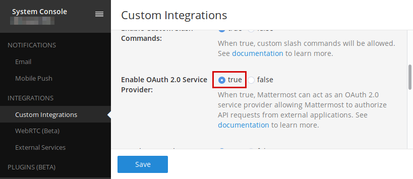
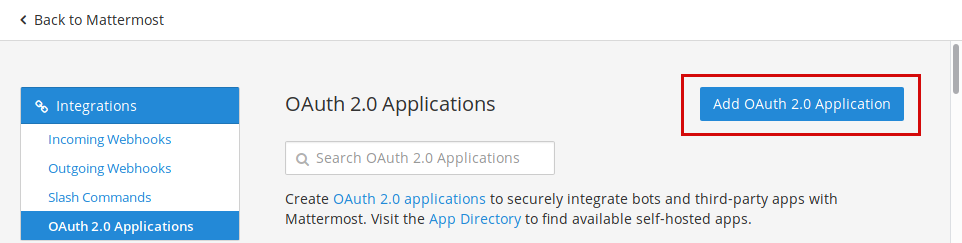
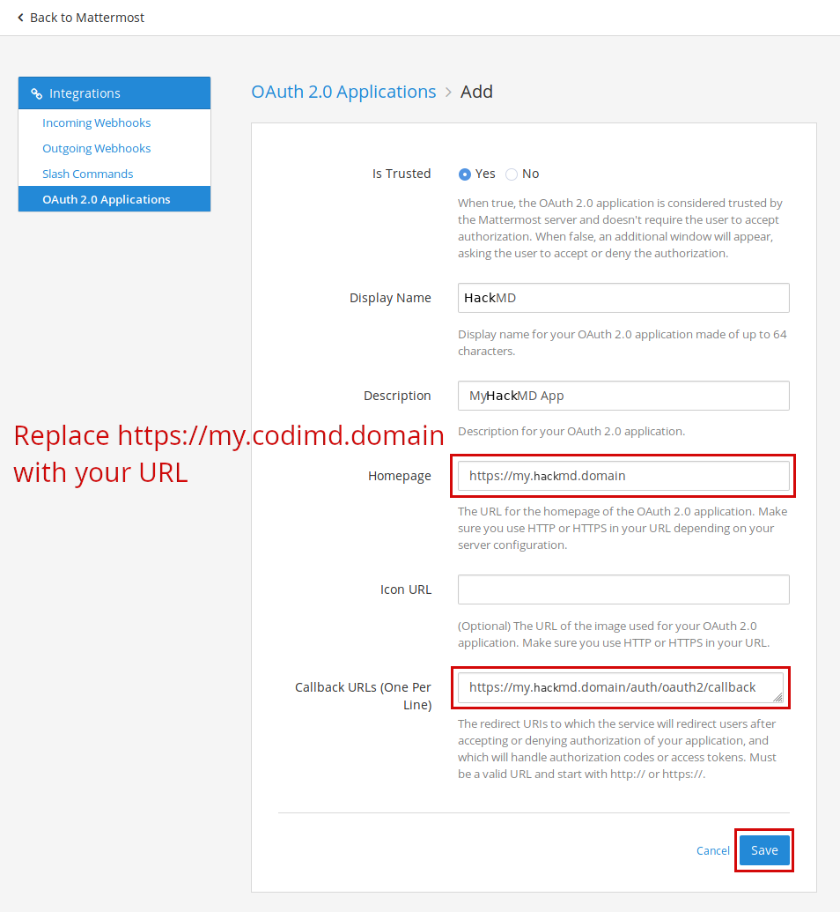
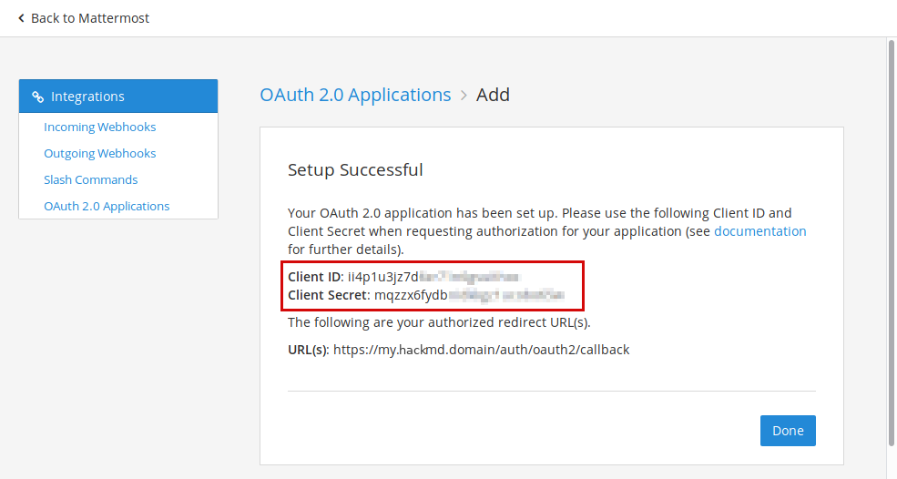

Authentication guide - Mattermost (self-hosted)
===

*Note: The Mattermost setup portion of this document is just a quick guide. See the [official documentation](https://docs.mattermost.com/developer/oauth-2-0-applications.html) for more details.*

This guide uses the generic OAuth2 module for compatibility with Mattermost version 5.0 and above.

1. Sign-in with an administrator account to your Mattermost instance
2. Make sure **OAuth 2.0 Service Provider** is enabled in the Main Menu (menu button next to your username in the top left corner) --> System Console --> Custom Integrations menu, which you can find at `https://your.mattermost.domain/admin_console/integrations/custom`



3. Navigate to the OAuth integration settings through Main Menu --> Integrations --> OAuth 2.0 Applications, at `https://your.mattermost.domain/yourteam/integrations/oauth2-apps`
4. Click on the **Add OAuth 2.0 Application** button to add a new OAuth application



5. Fill out the form and click **Save**



*Note: The callback URL is \<your-hackmd-url\>/auth/oauth2/callback*

6. After saving the application, you'll receive the Client ID and Client Secret



7. Add the Client ID and Client Secret to your config.json file or pass them as environment variables
    * config.json:
      ````javascript
      {
        "production": {
          "oauth2": {
              "baseURL": "https://your.mattermost.domain",
              "userProfileURL": "https://your.mattermost.domain/api/v4/users/me",
              "userProfileUsernameAttr": "id",
              "userProfileDisplayNameAttr": "username",
              "userProfileEmailAttr": "email",
              "tokenURL": "https://your.mattermost.domain/oauth/access_token",
              "authorizationURL": "https://your.mattermost.domain/oauth/authorize",
              "clientID": "ii4p1u3jz7dXXXXXXXXXXXXXXX",
              "clientSecret": "mqzzx6fydbXXXXXXXXXXXXXXXX"
          }
        }
      }
      ````
    * environment variables:
      ````
      HMD_OAUTH2_BASEURL=https://your.mattermost.domain
      HMD_OAUTH2_USER_PROFILE_URL=https://your.mattermost.domain/api/v4/users/me
      HMD_OAUTH2_USER_PROFILE_USERNAME_ATTR=id
      HMD_OAUTH2_USER_PROFILE_DISPLAY_NAME_ATTR=username
      HMD_OAUTH2_USER_PROFILE_EMAIL_ATTR=email
      HMD_OAUTH2_TOKEN_URL=https://your.mattermost.domain/oauth/access_token
      HMD_OAUTH2_AUTHORIZATION_URL=https://your.mattermost.domain/oauth/authorize
      HMD_OAUTH2_CLIENT_ID=ii4p1u3jz7dXXXXXXXXXXXXXXX
      HMD_OAUTH2_CLIENT_SECRET=mqzzx6fydbXXXXXXXXXXXXXXXX
      ````
