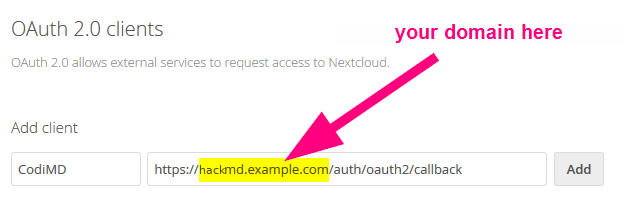
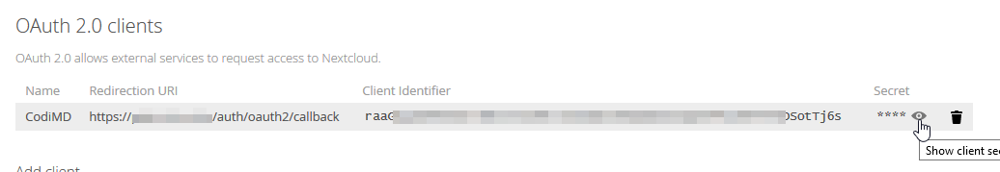

Authentication guide - Nextcloud (self-hosted)
===

*This has been constructed using the [Nextcloud OAuth2 Documentation](https://docs.nextcloud.com/server/14/admin_manual/configuration_server/oauth2.html?highlight=oauth2) combined with [this issue comment on the nextcloud bugtracker](https://github.com/nextcloud/server/issues/5694#issuecomment-314761326).*

This guide uses the generic OAuth2 module for compatibility with Nextcloud 13 and above (this guide has been tested successfully with Nextcloud 14).

1. Sign-in with an administrator account to your Nextcloud server

2. Navigate to the OAuth integration settings: Profile Icon (top right) --> Settings
   Then choose Security Settings from the *Administration* part of the list - Don't confuse this with Personal Security Settings, where you would change your personal password!
   At the top there's OAuth 2.0-Clients.
   

3. Add your HackMD instance by giving it a *name* (perhaps HackMD, but could be anything) and a *Redirection-URI*. The Redirection-URI will be `\<your-hackmd-url\>/auth/oauth2/callback`. Click <kbd>Add</kbd>.
   


4. You'll now see a line containing a *client identifier* and a *Secret*.
   

5. That's it for Nextcloud, the rest is configured in your HackMD `config.json` or via the `CMD_` environment variables!

6. Add the Client ID and Client Secret to your `config.json` file or pass them as environment variables. Make sure you also replace `<your-nextcloud-domain>` with the right domain name.
    * `config.json`:
      ```javascript
      {
        "production": {
          "oauth2": {
              "clientID": "ii4p1u3jz7dXXXXXXXXXXXXXXX",
              "clientSecret": "mqzzx6fydbXXXXXXXXXXXXXXXX",
              "authorizationURL": "https://<your-nextcloud-domain>/apps/oauth2/authorize",
              "tokenURL": "https://<your-nextcloud-domain>/apps/oauth2/api/v1/token",
              "userProfileURL": "https://<your-nextcloud-domain>/ocs/v2.php/cloud/user?format=json",
              "userProfileUsernameAttr": "ocs.data.id",
              "userProfileDisplayNameAttr": "ocs.data.display-name",
              "userProfileEmailAttr": "ocs.data.email"
          }
        }
      }
      ```
    * environment variables:
      ```sh
      CMD_OAUTH2_CLIENT_ID=ii4p1u3jz7dXXXXXXXXXXXXXXX
      CMD_OAUTH2_CLIENT_SECRET=mqzzx6fydbXXXXXXXXXXXXXXXX
      CMD_OAUTH2_AUTHORIZATION_URL=https://<your-nextcloud-domain>/apps/oauth2/authorize
      CMD_OAUTH2_TOKEN_URL=https://<your-nextcloud-domain>/apps/oauth2/api/v1/token
      CMD_OAUTH2_USER_PROFILE_URL=https://<your-nextcloud-domain>/ocs/v2.php/cloud/user?format=json
      CMD_OAUTH2_USER_PROFILE_USERNAME_ATTR=ocs.data.id
      CMD_OAUTH2_USER_PROFILE_DISPLAY_NAME_ATTR=ocs.data.display-name
      CMD_OAUTH2_USER_PROFILE_EMAIL_ATTR=ocs.data.email
      ```
