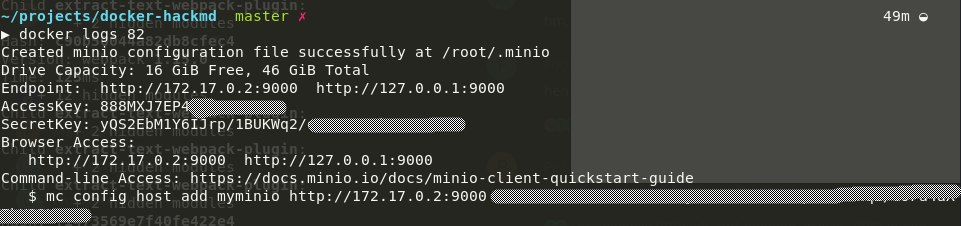
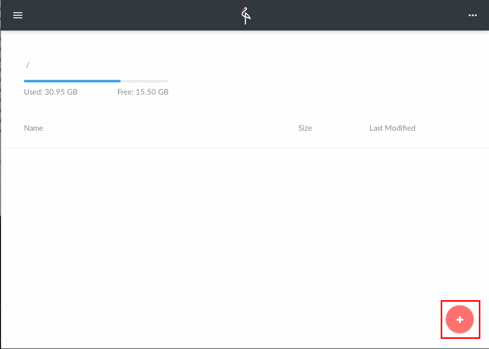
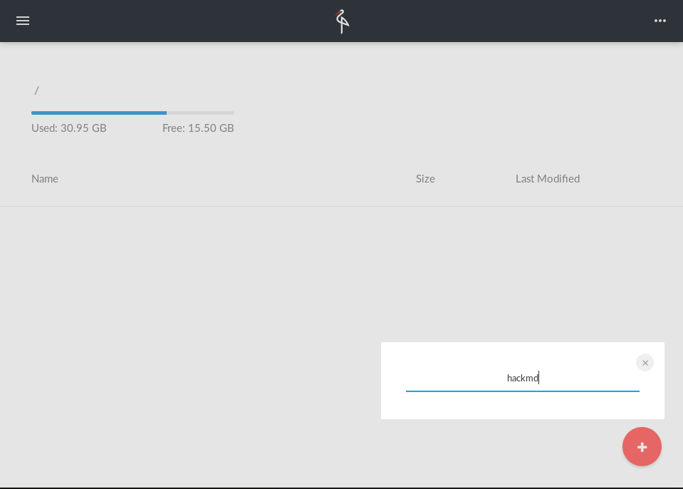
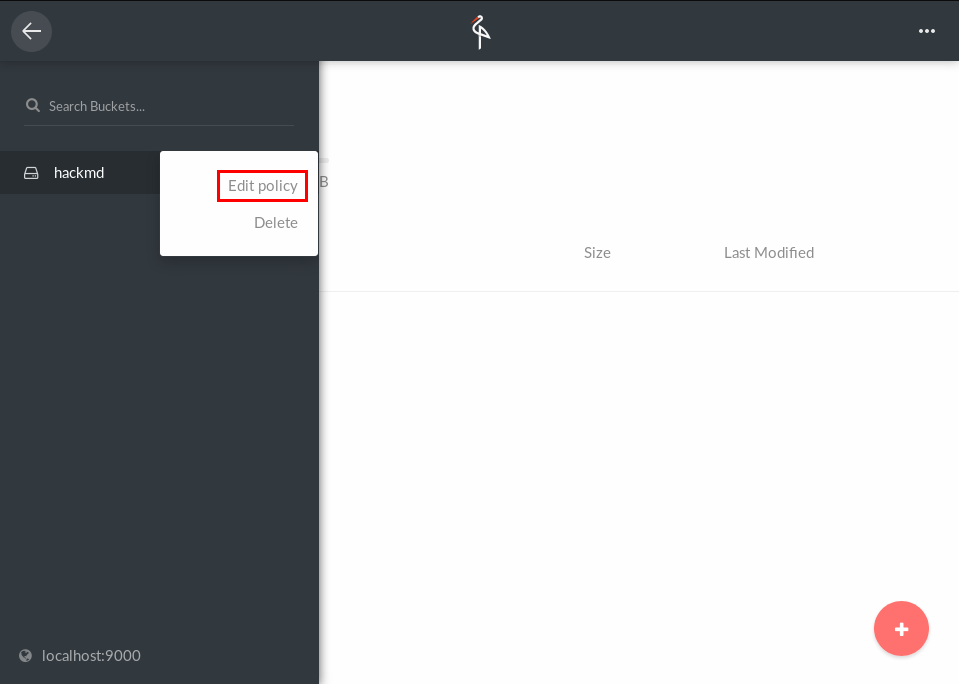
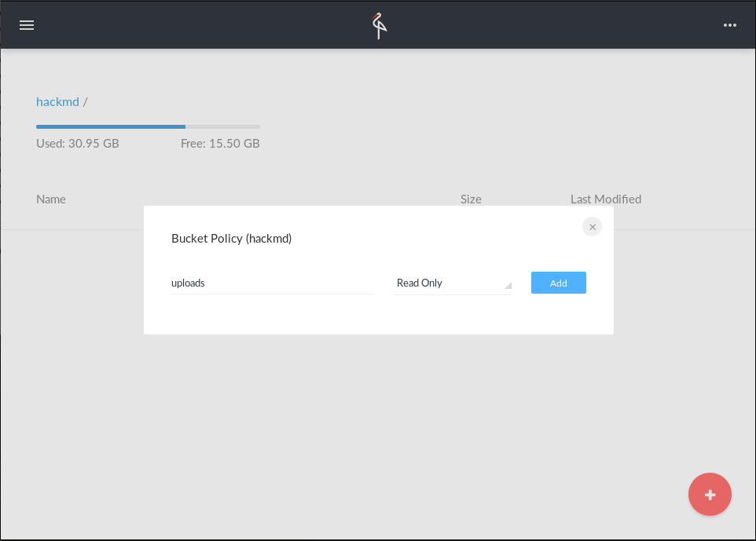

Minio Guide for CodiMD
===

***Note:** This guide was written before the renaming. Just replace `HackMD` with `CodiMD` in your mind :smile: thanks!*

1. First of all you need to setup Minio itself.

   Please refer to the [official Minio docs](https://docs.minio.io/) for an
   production setup.

   For checking it out and development purposes a non-persistent setup is enough:
   ```console
   docker run --name test-minio --rm -d -p 9000:9000 minio/minio server /data
   ```

   *Please notice this is not for productive use as all your data gets lost
   when you stop this container*

2. Next step is to get the credentials form the container:

   ```
   docker logs test-minio
   ```

   

3. Open http://localhost:9000 and login with the shown credentials.

   

4. Create a bucket for HackMD

   

5. Add a policy for the prefix `uploads` and make it read-only.

   
   *Open policy editor*

   
   *Add policy for uploads*

6. Set credentials and configs for Minio in HackMD's `config.json`

   ```JSON
   "minio": {
     "accessKey": "888MXJ7EP4XXXXXXXXX",
     "secretKey": "yQS2EbM1Y6IJrp/1BUKWq2/XXXXXXXXXXXXXXX",
     "endPoint": "localhost",
     "port": 9000,
     "secure": false
   }
   ```
   *You have to use different values for `endpoint` and `port` for a production
   setup. Keep in mind the `endpoint`-address has to be public accessible from
   your browser.*

7. Set bucket name

   ```JSON
   "s3bucket": "hackmd"
   ```

8. Set upload type.

   ```JSON
   "imageuploadtype": "minio"
   ```

9. Review your config.

   ```json
   {
     // all your other config…
     "minio": {
       "accessKey": "888MXJ7EP4XXXXXXXXX",
       "secretKey": "yQS2EbM1Y6IJrp/1BUKWq2/XXXXXXXXXXXXXXX",
       "endPoint": "localhost",
       "port": 9000,
       "secure": false
     },
     "s3bucket": "hackmd",
     "imageuploadtype": "minio"
   }
   ```
