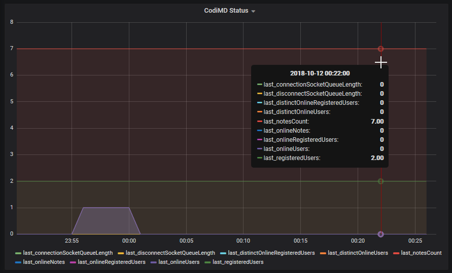

# Monitoring your CodiMD instance with telegraf

CodiMD provides an easy way to monitor very basic metrics. Those can easily be
recorded by [telegraf](https://github.com/influxdata/telegraf) for further use
with - for example - [influxdb](https://www.influxdata.com/time-series-platform/influxdb/)
and [grafana](https://grafana.com/).

To collect the metrics, use the [http input plugin](https://github.com/influxdata/telegraf/tree/master/plugins/inputs/http).
It will convert all numeric values from json and store them in your database.



```toml
# /etc/telegraf/telegraf.d/codimd.conf
[[inputs.http]]
  interval = "1m" # strictly speaking this line is not even neccessary
  urls = [
    "https://your-codi-server/status" # change this!
  ]
  data_format = "json"
```

You will now start seeing the values in Grafana, as a start, you can use this
panel:

```json
{
  "type": "graph",
  "title": "CodiMD Status",
  "gridPos": {
    "x": 0,
    "y": 30,
    "w": 12,
    "h": 9
  },
  "id": 109,
  "datasource": null,
  "targets": [
    {
      "policy": "default",
      "resultFormat": "time_series",
      "orderByTime": "ASC",
      "tags": [
        {
          "key": "url",
          "operator": "=",
          "value": "https://your-codi-server/status"
        }
      ],
      "groupBy": [
        {
          "type": "time",
          "params": [
            "$__interval"
          ]
        },
        {
          "type": "fill",
          "params": [
            "null"
          ]
        }
      ],
      "select": [
        [
          {
            "type": "field",
            "params": [
              "*"
            ]
          },
          {
            "type": "last",
            "params": []
          }
        ]
      ],
      "refId": "A",
      "measurement": "http",
      "alias": "$col",
      "limit": ""
    }
  ],
  "renderer": "flot",
  "yaxes": [
    {
      "label": null,
      "show": true,
      "logBase": 1,
      "min": null,
      "max": null,
      "format": "short"
    },
    {
      "label": null,
      "show": true,
      "logBase": 1,
      "min": null,
      "max": null,
      "format": "short"
    }
  ],
  "xaxis": {
    "show": true,
    "mode": "time",
    "name": null,
    "values": [],
    "buckets": null
  },
  "yaxis": {
    "align": false,
    "alignLevel": null
  },
  "lines": true,
  "fill": 1,
  "linewidth": 1,
  "dashes": false,
  "dashLength": 10,
  "spaceLength": 10,
  "points": false,
  "pointradius": 5,
  "bars": false,
  "stack": false,
  "percentage": false,
  "legend": {
    "show": true,
    "values": false,
    "min": false,
    "max": false,
    "current": false,
    "total": false,
    "avg": false
  },
  "nullPointMode": "null",
  "steppedLine": false,
  "tooltip": {
    "value_type": "individual",
    "shared": true,
    "sort": 0
  },
  "timeFrom": null,
  "timeShift": null,
  "aliasColors": {},
  "seriesOverrides": [],
  "thresholds": [],
  "interval": "1m",
  "links": [],
  "transparent": false
}
```
