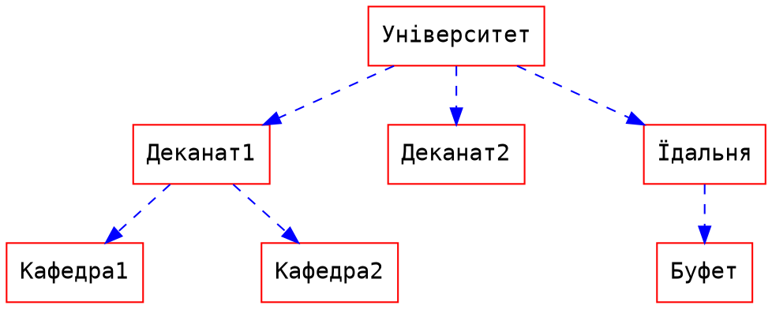
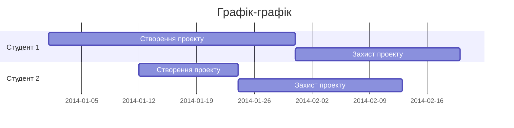

Кузня контенту
===

Вступ
===
**Кузня контенту** - це мультиплатформний онлайн редактор документів **markdown** з можливостями спільного доступу до перегляду та редагування.

Це означає, що ви можете створювати документи разом з іншими людьми, використовуючи **ПК**, **планшет** та навіть **смартфон**.

Також ви можете авторизуватись за допомогою різних систем, таких як **Facebook**, **Twitter**, **GitHub** та інших, використовуючи [_домашню сторінку_](/).

Якщо у вас виникли будь-які _проблеми_, не соромтеся повідомити про це на [**GitHub**](https://github.com/hackmdio/codimd/issues).
Або зв'яжіться з нами на  [**Gitter**](https://gitter.im/hackmdio/hackmd) для обговорення будь-яких ідей щодо покращення, або отримання допомоги.

**Дякуємо!**

Робоча область
===
## Режими роботи:
**Стаціонарний та планшетний ПК**

<i class="fa fa-edit fa-fw"></i> Редагування: щоб бачити лише код.
<i class="fa fa-eye fa-fw"></i> Перегляд: щоб бачити візуальний результат.
<i class="fa fa-columns fa-fw"></i> Спільний режим: щоб бачити і те, і інше.

**Мобільний**

<i class="fa fa-toggle-on fa-fw"></i> Перегляд: щоб бачити візуальний результат.
<i class="fa fa-toggle-off fa-fw"></i> Редагування: щоб бачити лише код.

## Темна тема:
Якщо ви не бажаєте бачити білий фон статті, і хочете переглядати все на чорному тлі, натисніть на іконку півмісяця <i class="fa fa-moon-o"></i> та оберіть темну тему Кузні контенту.

Вигляд редактора, що перебуває у нічному режимі, можна також повернути до попереднього стану, натиснувши на іконку сонця <i class="fa fa-sun-o fa-fw"></i>.

## Завантаження зображень:
Ви можете завантажити зображення, натиснувши кнопку камери <i class="fa fa-camera"></i>.
Також, ви можете просто перетягнути зображення в редактор. Це можно зробити і за допомогою буфера обміну, просто натиснувши **Ctrl+V**.

Зображення буде автоматично завантжено в **[imgur](http://imgur.com)**, **[Amazon S3](https://aws.amazon.com/s3/)**, **[Minio](https://minio.io)** або **локальну файлову систему**, і тому вам не потрібно буде додатково за це перейматися :tada:.


## Публікація документів:
Якщо ви хочете поділитися документом з можливістю **редагування** -- просто скопіюйте URL-адресу веб-сторінки.
Якщо ви хочете поділитися документом так, щоб його можна було лише **переглядати**, натисніть кнопку "Опублікувати" <i class="fa fa-share-square-o"></i> та скопіюйте отриману URL-адресу для подальшого поширення.

## Збереження документів:
Наразі ви можете зберегти файл на **Dropbox** <i class="fa fa-dropbox"></i> або **завантажити** <i class="fa fa-file-text"></i>  його у форматі `.md`  у локальну базу.

## Імпорт документів:
Аналогічно до функції _збереження_, ви також можете завантажити файл формату `.md` з **Dropbox** <i class="fa fa-dropbox"></i>, або **буферу обміну** <i class="fa fa-clipboard"></i>, and that can parse some **html** which might be useful :smiley:

## Рівень доступу:
Можна змінити дозвіл на доступ до документу за допомогою маленької кнопки у верхньому правому куті екрана. 
Можливі шість варіантів:

|                              |Читання/редагування для власника|Читання для зареєстрованого|Редагування для зареєстрованого|Читання для незареєстрованого|Редагування для незареєстрованого|
|:-----------------------------|:--------------:|:------------:|:-------------:|:--------:|:---------:|
|<span class="text-nowrap"><i class="fa fa-leaf fa-fw"></i> **Freely**</span>               |✔|✔|✔|✔|✔|
|<span class="text-nowrap"><i class="fa fa-pencil fa-fw"></i> **Editable**</span>           |✔|✔|✔|✔|✖|
|<span class="text-nowrap"><i class="fa fa-id-card fa-fw"></i> **Limited**</span>           |✔|✔|✔|✖|✖|
|<span class="text-nowrap"><i class="fa fa-lock fa-fw"></i> **Locked**</span>               |✔|✔|✖|✔|✖|
|<span class="text-nowrap"><i class="fa fa-umbrella fa-fw"></i> **Protected**</span>        |✔|✔|✖|✖|✖|
|<span class="text-nowrap"><i class="fa fa-hand-stop-o fa-fw"></i> **Private**</span>       |✔|✖|✖|✖|✖|


**Лише власник документу може змінити рівень дозволу документу.**

## Вбудовування документу:
Документи можна вбудувати так:

```html
<iframe width="100%" height="500" src="https://content.hneu.edu.ua/features" frameborder="0"></iframe>
```

## [Режим презентації](./slide-example):
Ви можете використовувати спеціальний синтаксис для перетворення документу у слайди презентації.

Для цього ви можете скористатися  **[Режимом презентації](./slide-example)** <i class="fa fa-tv"></i>.
Перейдіть за вищенаведеним посиланням для отримання більш докладних інструкцій.

Для того, щоб переключити редактор у режим презентації, змініть [document type](./yaml-metadata#type) на `slide`.

Перегляд
===
## Зміст:
В правій нижній частині області перегляду є кнопка _ToC_  <i class="fa fa-bars"></i>  (відображається лише у **спільному режимі**).
При натисканні цієї кнопки ви побачите поточний зміст -- _Table of Contents_, де буде виділено розділ, в якому ви перебуваєте. 
ToC відображає до **трьох рівнів заголовків**.

## Постійне посилання:
Кожен заголовок автоматично створює постійне посилання з лівого боку від себе. 
Ви можете навести курсор миші та натиснути на <i class="fa fa-chain"></i> для того, щоб перейти до відповідної частини документу.

Редагування
===
## Режим редагування:
У правому нижньому кутку області редактора є кнопка з підписом `sublime`.
Натиснувши на неї, ви можете вибрати 3 режими редактора:

- sublime (за замовчуванням);
- emacs;
- vim.

## Комбінації клавіш:
Комбінації клавіш залежать від обраного режиму редактора. За замовчуванням вони такі ж, як текст Sublime, що досить швидко і зручно.

> Більше інформації дивіться [тут](https://codemirror.net/demo/sublime.html).

Для emacs:
> Більше інформації дивіться [тут](https://codemirror.net/demo/emacs.html).

Для vim:
> Більше інформації дивіться [тут](https://codemirror.net/demo/vim.html).

## Автозаповнення:
Цей редактор надає повну підказку щодо автоматичного заповнення markdown.
- Емоджі: введіть `:`, щоб показати підказки.
- Кодові блоки: введіть ` ``` ` та додатковий символ, щоб показати підказку.
- Заголовки: введіть`#`, щоб показати підказки.
- Посилання: введіть `[]`, щоб показати підказки.
- Externals: введіть `{}`, щоб показати підказки.
- Зображення: введіть `!`, щоб показати підказки.

## Назва документу:
Перший заголовок **першого рівня** буде використовуватись як назва документу.

## Теги:
При використанні тегів наступним чином, зазначені теги відобразяться у вашій **історії** .
###### теги: `особливості` `навчання` `оновлення`

## [Метадані YAML:](./yaml-metadata)

Ви можете надати розширену інформацію про документ, встановивши певну надбудову у браузер (перегляньте посилання вище):
- robots: встановлення метаботів;
- lang: встановлення мови браузера;
- dir: встановлення напрямку тексту;
- breaks: встановлюється для використання розривів рядків;
- GA: встановлюється для використання Google Analytics;
- disqus: встановлюється для використання Disqus;
- slideOptions: налаштування параметрів режиму слайдів.

## ToC:
Використайте елемент `[TOC]`, щоб додати *Зміст* у ваш документ.

[TOC]

## Emoji:
Ви можете ввести будь-який смайлик, наприклад: :smile: :smiley: :cry: :wink:.
> Повний перелік смайлів можна подивитися [тут](http://www.emoji-cheat-sheet.com/).

## Перелік завдань:
- [ ] План
  - [x] Купити овочі.
  - [ ] Розробити електронний посібник.
  - [x] Випити трохи води.

## Блоки коду:
Ми підтримуємо багато мов програмування. Використовуйте функцію автоматичного заповнення, щоб побачити весь список.
```javascript=
var s = "JavaScript syntax highlighting";
alert(s);
function $initHighlight(block, cls) {
  try {
    if (cls.search(/\bno\-highlight\b/) != -1)
      return process(block, true, 0x0F) +
             ' class=""';
  } catch (e) {
    /* handle exception */
  }
  for (var i = 0 / 2; i < classes.length; i++) {
    if (checkCondition(classes[i]) === undefined)
      return /\d+[\s/]/g;
  }
}
```

> Якщо потрібно позначити **номери рядків**, введіть = після введення мови блоку коду.
> Також ви можете вказати номер рядка, з якого почнеться код.
> Так, у блоці нижче, номер рядка починається зі 101:
```javascript=101
var s = "JavaScript syntax highlighting";
alert(s);
function $initHighlight(block, cls) {
  try {
    if (cls.search(/\bno\-highlight\b/) != -1)
      return process(block, true, 0x0F) +
             ' class=""';
  } catch (e) {
    /* handle exception */
  }
  for (var i = 0 / 2; i < classes.length; i++) {
    if (checkCondition(classes[i]) === undefined)
      return /\d+[\s/]/g;
  }
}
```

> Або ви можете продовжити нумерацію рядків попереднього кодового блоку, використовуючи`=+`:

```javascript=+
var s = "JavaScript syntax highlighting";
alert(s);
```

> Іноді у вас може виникати надто довгий текст без переносів . Використайте `!` для перенесення стрічок коду.

```!
When you’re a carpenter making a beautiful chest of drawers, you’re not going to use a piece of plywood on the back.
```

### Коментарі:
> Використовуйте наступний синтаксис, щоб вказати своє  **ім'я, час та колір** для внесення різноманіття у коментарі.
> [name=Тарас Шевченко] [time=Ср, червень 24, 2020 9:59 PM] [color=#907bf7]
> > Їх також можна групувати!
> > [name=Тарас Шевченко] [time=Ср, червень 24, 2020 10:00 PM] [color=red]

## Зовнішні матеріали:

### YouTube


### Vimeo


### Gist


### SlideShare


### PDF
**Увага: Ваш веб-переглядач може бути заблокований, якщо не використовується `https` URL-адреса.**


## MathJax:

Ви можете використовувати математичні вирази та формули **MathJax**, як на [math.stackexchange.com](http://math.stackexchange.com/):

Функція *Gamma*, що задовольняє $\Gamma(n) = (n-1)!\quad\forall n\in\mathbb N$, що здійснюється через інтеграл Ейлера:

$$
x = {-b \pm \sqrt{b^2-4ac} \over 2a}.
$$

$$
\Gamma(z) = \int_0^\infty t^{z-1}e^{-t}dt\,.
$$

> Більш детально про математичні вирази **LaTeX** можна почитати [тут](http://meta.math.stackexchange.com/questions/5020/mathjax-basic-tutorial-and-quick-reference).

## Діаграми UML:

### Діаграми послідовності

Діаграми послідовностей можна надати таким чином:

```sequence
Марічка->Іван: Привіт, Іван, як справи?
Note right of Іван: Іван посміхається
Іван-->Марічка: Все добре, дякую.
Note left of Марічка: Марічка позіхає
Марічка->Іван: Коли у нас сессія?
```

### Алгоритми

Алгоритми можна вказати так:
```flow
st=>start: Початок
e=>end: Кінець
op=>operation: Обчислення
op2=>operation: Текст Текст Текст
cond=>condition: Так чи ні?

st->op->op2->cond
cond(yes)->e
cond(no)->op2
```

### Графік класифікації


### Графік з часом


### Ноти
```abc
X:1
T:Speed the Plough
M:4/4
C:Trad.
K:G
|:GABc dedB|dedB dedB|c2ec B2dB|c2A2 A2BA|
GABc dedB|dedB dedB|c2ec B2dB|A2F2 G4:|
|:g2gf gdBd|g2f2 e2d2|c2ec B2dB|c2A2 A2df|
g2gf g2Bd|g2f2 e2d2|c2ec B2dB|A2F2 G4:|
```

### PlantUML
```plantuml
start
if (condition A) then (yes)
  :Text 1;
elseif (condition B) then (yes)
  :Text 2;
  stop
elseif (condition C) then (yes)
  :Text 3;
elseif (condition D) then (yes)
  :Text 4;
else (nothing)
  :Text else;
endif
stop
```

### Vega-Lite
```vega
{
  "$schema": "https://vega.github.io/schema/vega-lite/v4.json",
  "data": {"url": "https://vega.github.io/editor/data/barley.json"},
  "mark": "bar",
  "encoding": {
    "x": {"aggregate": "sum", "field": "yield", "type": "quantitative"},
    "y": {"field": "variety", "type": "nominal"},
    "color": {"field": "site", "type": "nominal"}
  }
}
```

### Fretboad

```fretboard {title="horizontal, 5 frets", type="h6 noNut"}
-oO-*-
--o-o-
-o-oo-
-o-oO-
-oo-o-
-*O-o-
```

### Mindmap

```markmap
# markmap-lib

## Links

- <https://markmap.js.org/>
- [GitHub](https://github.com/gera2ld/markmap-lib)

## Related

- [coc-markmap](https://github.com/gera2ld/coc-markmap)
- [gatsby-remark-markmap](https://github.com/gera2ld/gatsby-remark-markmap)

## Features

- links
- **inline** ~~text~~ *styles*
- multiline
  text
```

> Детальніше про **діаграми послідовності** можна прочитати [тут](http://bramp.github.io/js-sequence-diagrams/).
> Детальніше про **алгоритми** можна прочитати [тут](http://adrai.github.io/flowchart.js/).
> Детальніше про **графіки класифікації** можна прочитати [тут](http://www.tonyballantyne.com/graphs.html).
> Детальніше про **часові графіки** можна прочитати [тут](http://mermaid-js.github.io/mermaid).
> Детальніше про **ноти** можна прочитати [тут](http://abcnotation.com/learn).
> Детальніше про **plantuml** можна прочитати [тут](http://plantuml.com/index).
> Детальніше проt **vega** можна прочитати [тут](https://vega.github.io/vega-lite/docs).

Область повідомлень:
---
:::success
Вітаємо :tada:
:::

:::info
Це інформаційне повідомлення :mega:
:::

:::warning
Попередження :zap:
:::

:::danger
Обережно! :fire:
:::

:::spoiler Натисніть сюди для отримання деталей.
А ось і я :stuck_out_tongue_winking_eye:.
:::

## Форматування тексту:

### Заголовки

```
# h1 Заголовок
## h2 Заголовок
### h3 Заголовок
#### h4 Заголовок
##### h5 Заголовок
###### h6 Заголовок
```

### Горизонтальні лінії

___

---

***


### Автозаміна

Увімкніть опцію друкарської автозаміни, щоб побачити результат.

(c) (C) (r) (R) (tm) (TM) (p) (P) +-

тест.. тест... тест..... тест?..... тест!....

!!!!!! ???? ,,

Два дефіси -- довге тире

"Подвійні лапки"

'Одинарні лапки'

### Акценти

**Це полужирний текст**

__Це полужирний текст__

*Це курсив*

_Це курсив_

~~Закреслений текст~~

Раз ~дватри~


Надрядковий текст: 19^th^

Підрядковий текст: H~2~O

++Підкреслений текст++

==Виділений текст==

### Цитати


> Цитати також можна групувати ...
>> ...за допомогою додаткових знаків `>` , якщо розміщувати їх поруч..
> > > ...або з пробілами.


### Списки

#### Маркований

+ Створіть список, починаючи рядок із `+`, `-`, або `*`
+ Підсписки формуються відступом з 2 пробілів:
  - Зміна символів маркера змушує запустити новий список:
    * Ac tristique libero volutpat at
    + Facilisis in pretium nisl aliquet
    - Nulla volutpat aliquam velit
+ Дуже просто!

#### Нумерований

1. Світає
2. Край неба палає
3. Соловейко в темнім гаї сонце зустрічає


1. Ви можете використовувати послідовні номери ...
1. ...або завжди ставити `1.`
1. feafw
2. 332
3. 242
4. 2552
1. e2

Почніть нумерацію зі зміщенням:

57. Верба
1. Тополя

### Код

Рядок `code`

Indented code

    // Some comments
    line 1 of code
    line 2 of code
    line 3 of code


Block code "fences"

```
Sample text here...
```

Підсвічування синтаксису:

``` js
var foo = function (bar) {
  return bar++;
};

console.log(foo(5));
```

### Таблиці

| Назва  | Пояснення   |
| ------ | ----------- |
| ЕІ     | Факультет економічної інформатики. |
| ХНЕУ   | Харківський національний економічний університет імені Семена Кузнеця.  |
| Харків | Місто на північному сході України на Слобожанщині. |

Вирівнювання по правому краю

| Назва   |  Пояснення   |
| ------: | -----------: |
| ЕІ      | Факультет економічної інформатики. |
| ХНЕУ    | Харківський національний економічний університет імені Семена Кузнеця.  |
| Харків  | Місто на північному сході України на Слобожанщині. |

Вирівнювання по лівому краю

| Назва   | Пояснення    |
| :------ | :----------- |
| ЕІ      | Факультет економічної інформатики. |
| ХНЕУ    | Харківський національний економічний університет імені Семена Кузнеця.  |
| Харків  | Місто на північному сході України на Слобожанщині. |

Вирівнювання по центру

| Назва    | Пояснення     |
| :------: | :-----------: |
| ЕІ       | Факультет економічної інформатики. |
| ХНЕУ     | Харківський національний економічний університет імені Семена Кузнеця.  |
| Харків   | Місто на північному сході України на Слобожанщині. |


### Посилання
[Текст посилання](http://dev.nodeca.com)
[Посилання з заголовком](http://nodeca.github.io/pica/demo/ "А ось і заголовок!")
Автоперетворене посилання https://github.com/nodeca/pica


### Зображення


Подібно до посилань, зображення також мають синтаксис віповідний стилю примітки: 
![Alt text][id]
Зображення з посиланням та заголовком, поданим нижче в документі, що визначає URL-адресу:

[id]: https://octodex.github.com/images/dojocat.jpg  "Ніндзя-кішка"


Можна відобразити зображення із заданим розміром.

### Підрядкові посилання (примітки)

Примітка 1 з посиланням[^first].
Примітка 2 з посиланням[^second].
Вбудована примітка^[Текст вбудованої примітки].
Дублювання посилання на виноску[^second].

[^first]: Примітка **може мати розмітку**
    та кілька абзаців.
[^second]: Примітка з текстом.

### Визначення

Термін 1

:   Визначення 1 
з коротким продовженням.

Термін 2 з *вбудованою розміткою*

:   Визначення 2

        { трішки коду, друга частина Визначення 2 }

    Третій пункт визначення Визначення 2.

_Компактний стиль:_

Термін 1
  ~ Визначення 1

Термін 2
  ~ Визначення 2а
  ~ Визначення 2b

### Абревіатури

Це приклад абревіатури HTML.
Слово "HTML" конвертується, але лише при повному співпадінні, у таких словах, як, наприклад, "xxxHTMLyyy" абревіатура не буде відображатися.

*[HTML]: Hyper Text Markup Language
