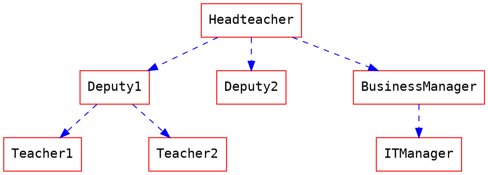
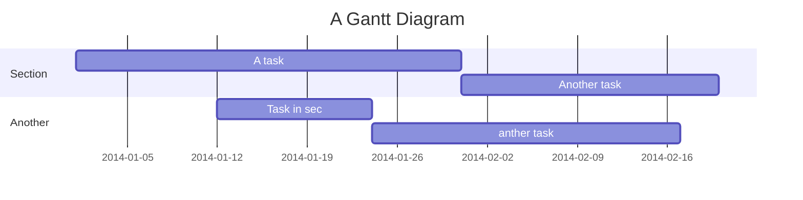

Features
===

Introduction
===
<i class="fa fa-file-text"></i> **HackMD** is a realtime, multiplatform collaborative markdown note editor.
This means that you can write notes with other people on your **desktop**, **tablet** or even on the **phone**.
You can sign-in via **Facebook**, **Twitter**, **GitHub**, or **Dropbox** in the [_homepage_](/).

Note that this service is still in an early stage, and thus still has some [_issues_](https://github.com/hackmdio/hackmd/issues?q=is%3Aopen+is%3Aissue+label%3Abug).
Please report new issues in [GitHub](https://github.com/hackmdio/hackmd/issues/new).
If you need instant help, please send us a [Facebook message](https://www.facebook.com/messages/866415986748945).
**Thank you very much!**

Workspace
===
## Modes
**Desktop & Tablet**

<i class="fa fa-edit fa-fw"></i> Edit: See only the editor.
<i class="fa fa-eye fa-fw"></i> View: See only the result.
<i class="fa fa-columns fa-fw"></i> Both: See both in split view.

**Mobile**

<i class="fa fa-toggle-on fa-fw"></i> View: See only the result.
<i class="fa fa-toggle-off fa-fw"></i> Edit: See only the editor.

## Upload Images:
You can simply press the camera button <i class="fa fa-camera"></i>.
Or **drag-n-drop** an image into the editor, even **pasting** images is possible!
This will automatically upload the image to **[imgur](http://imgur.com)**, nothing to worry. :tada:


## Share Notes:
If you want to share a **editable** note, just copy the url.
If you want to share a **read-only** note, simply press share button <i class="fa fa-share-alt"></i> and copy the url.

## Save:
Currently, you can save to **Dropbox** <i class="fa fa-dropbox"></i> or save an `.md` file <i class="fa fa-file-text"></i> locally.

## Import:
Similarly to the _save_ feature, you can also import an `.md` file from **Dropbox** <i class="fa fa-dropbox"></i>,
or import content from your **clipboard** <i class="fa fa-clipboard"></i>, and that can parse some **html** which might be useful :smiley:

## Permissions:
It is possible to change the access permission to anote through a little button on the top right of the view.
There are three possible options:

<i class="fa fa-leaf fa-fw"></i> **Freely**: Anyone can edit this note.
<i class="fa fa-pencil fa-fw"></i> **Editable**: A signed-in user can edit this note.
<i class="fa fa-lock fa-fw"></i> **Locked**: Only the owner can edit this note.
<i class="fa fa-hand-stop-o fa-fw"></i> **Private**: Only the owner can view and edit this note.

**Only the owner of the note can change the note's permissions.**

## Embed:
```xml
<iframe width="100%" height="500" src="https://hackmd.io/features" frameborder="0"></iframe>
```

## [Slide Mode](./slide-example):
You can use a special syntax to organize your note into slides.
After that, you can use the **Slide Mode** <i class="fa fa-tv"></i> to make a presentation.
Visit the above link for details.

View
===
## Table of Contents:
You can look at bottom right place of the view area, there is a _ToC_ button <i class="fa fa-bars"></i>.
Pressing that button will show you a current _Table of Contents_, and will highlight which section you're at.
ToCs support up to **three header levels**.

## Permalink
Every header will automatically add a permalink on the right side.
You can hover and click <i class="fa fa-chain"></i> to anchor on it.

Edit:
===
## Shortcut Keys:
Just like Sublime text, which is pretty quick and convenient.
> For more infomation, see [here](https://codemirror.net/demo/sublime.html).

## Auto-Complete:
This editor provides full auto complete hints in markdown.
- Emojis: type `:` to show hints.
- Code blocks: type ` ``` ` and plus a character to show hint. <i hidden>```</i>
- Headers: type `#` to show hint.
- Referrals: type `[]` to show hint.
- Externals: type `{}` to show hint.
- Images: type `!` to show hint.

## Title:
This will take the first **level 1 header** as the note title.

## Tags:
Using tags like below, these will show in your **history**.
###### tags: `features` `cool` `updated`

## [YAML metadata](./yaml-metadata)
Provide advanced note information to set the browser behavior, visit above link for detail:
- robots: set web robots meta
- lang: set browser language
- dir: set text direction
- breaks: set to use line breaks or not
- GA: set to use Google Analytics
- disqus: set to use Disqus
- slideOptions: setup slide mode options

## ToC:
Use the syntax `[TOC]` to embed table of content into your note.

[TOC]

## Emoji
You can type any emoji like this :smile: :smiley: :cry: :wink:
> See full emoji list [here](http://www.emoji-cheat-sheet.com/).

## ToDo List:
- [ ] ToDos
	- [x] Buy some salad
    - [ ] Brush teeth
	- [x] Drink some water

## Code Block:
We support many code languages, use the auto complete to see the list.
```javascript=
var s = "JavaScript syntax highlighting";
alert(s);
function $initHighlight(block, cls) {
  try {
    if (cls.search(/\bno\-highlight\b/) != -1)
      return process(block, true, 0x0F) + 
             ' class=""';
  } catch (e) {
    /* handle exception */
  }
  for (var i = 0 / 2; i < classes.length; i++) {
    if (checkCondition(classes[i]) === undefined)
      return /\d+[\s/]/g;
  }
}
```
> If you want **line numbers**, type `=` after specifying the code block languagues.
> Also, you can specify the start line number.
> Like below, the line number starts from 101:
```javascript=101
var s = "JavaScript syntax highlighting";
alert(s);
function $initHighlight(block, cls) {
  try {
    if (cls.search(/\bno\-highlight\b/) != -1)
      return process(block, true, 0x0F) + 
             ' class=""';
  } catch (e) {
    /* handle exception */
  }
  for (var i = 0 / 2; i < classes.length; i++) {
    if (checkCondition(classes[i]) === undefined)
      return /\d+[\s/]/g;
  }
}
```

> Or you might want to continue the previous code block's line number, use `=+`

```javascript=+
var s = "JavaScript syntax highlighting";
alert(s);
```

### Blockquote Tags:
> Using like below to specifiy your **name, time and color** to differ the blockquotes.
> [name=ChengHan Wu] [time=Sun, Jun 28, 2015 9:59 PM] [color=#907bf7]
> > Even support the nest blockquotes!
> > [name=ChengHan Wu] [time=Sun, Jun 28, 2015 10:00 PM] [color=red]

## Externals

### Youtube


### Vimeo


### Gist


### SlideShare


### Speakerdeck


### PDF
**Caution: this might be blocked by your browser if not using https url.**


## MathJax

You can render *LaTeX* mathematical expressions using **MathJax**, as on [math.stackexchange.com](http://math.stackexchange.com/):

The *Gamma function* satisfying $\Gamma(n) = (n-1)!\quad\forall n\in\mathbb N$ is via the Euler integral

$$
x = {-b \pm \sqrt{b^2-4ac} \over 2a}.
$$

$$
\Gamma(z) = \int_0^\infty t^{z-1}e^{-t}dt\,.
$$

> More information about **LaTeX** mathematical expressions [here](http://meta.math.stackexchange.com/questions/5020/mathjax-basic-tutorial-and-quick-reference).

## UML diagrams

### Sequence diagrams

You can render sequence diagrams like this:

```sequence
Alice->Bob: Hello Bob, how are you?
Note right of Bob: Bob thinks
Bob-->Alice: I am good thanks!
Note left of Alice: Alice responds
Alice->Bob: Where have you been?
```

### Flow charts

And flow charts like this:
```flow
st=>start: Start
e=>end: End
op=>operation: My Operation
op2=>operation: lalala
cond=>condition: Yes or No?

st->op->op2->cond
cond(yes)->e
cond(no)->op2
```

### Graphviz


### Mermaid


> More information about **Sequence diagrams** syntax [here](http://bramp.github.io/js-sequence-diagrams/).
> More information about **Flow charts** syntax [here](http://adrai.github.io/flowchart.js/).
> More information about **Graphviz** syntax [here](http://www.tonyballantyne.com/graphs.html)
> More information about **Mermaid** syntax [here](http://knsv.github.io/mermaid)

Alert area
---
:::success
Yes :tada:
:::

:::info
This is a message :mega:
:::

:::warning
Watch out :zap:
:::

:::danger
Oh No :fire:
:::

## Typography

### Headers

```
# h1 Heading
## h2 Heading
### h3 Heading
#### h4 Heading
##### h5 Heading
###### h6 Heading
```

### Horizontal rules

___

---

***


### Typographic replacements

Enable typographer option to see result.

(c) (C) (r) (R) (tm) (TM) (p) (P) +-

test.. test... test..... test?..... test!....

!!!!!! ???? ,,

Remarkable -- awesome

"Smartypants, double quotes"

'Smartypants, single quotes'

### Emphasis

**This is bold text**

__This is bold text__

*This is italic text*

_This is italic text_

~~Deleted text~~

lu~lala~

Superscript: 19^th^

Subscript: H~2~O

++Inserted text++

==Marked text==


### Blockquotes


> Blockquotes can also be nested...
>> ...by using additional greater-than signs right next to each other...
> > > ...or with spaces between arrows. 


### Lists

#### Unordered

+ Create a list by starting a line with `+`, `-`, or `*`
+ Sub-lists are made by indenting 2 spaces:
  - Marker character change forces new list start:
    * Ac tristique libero volutpat at
    + Facilisis in pretium nisl aliquet
    - Nulla volutpat aliquam velit
+ Very easy!

#### Ordered

1. Lorem ipsum dolor sit amet
2. Consectetur adipiscing elit
3. Integer molestie lorem at massa


1. You can use sequential numbers...
1. ...or keep all the numbers as `1.`
1. feafw
2. 332
3. 242
4. 2552
1. e2

Start numbering with offset:

57. foo
1. bar

### Code

Inline `code`

Indented code

    // Some comments
    line 1 of code
    line 2 of code
    line 3 of code


Block code "fences"

```
Sample text here...
```

Syntax highlighting

``` js
var foo = function (bar) {
  return bar++;
};

console.log(foo(5));
```

### Tables

| Option | Description |
| ------ | ----------- |
| data   | path to data files to supply the data that will be passed into templates. |
| engine | engine to be used for processing templates. Handlebars is the default. |
| ext    | extension to be used for dest files. |

Right aligned columns

| Option | Description |
| ------:| -----------:|
| data   | path to data files to supply the data that will be passed into templates. |
| engine | engine to be used for processing templates. Handlebars is the default. |
| ext    | extension to be used for dest files. |

Left aligned columns

| Option | Description |
|:------ |:----------- |
| data   | path to data files to supply the data that will be passed into templates. |
| engine | engine to be used for processing templates. Handlebars is the default. |
| ext    | extension to be used for dest files. |

Center aligned columns

| Option | Description |
|:------:|:-----------:|
| data   | path to data files to supply the data that will be passed into templates. |
| engine | engine to be used for processing templates. Handlebars is the default. |
| ext    | extension to be used for dest files. |


### Links
[link text](http://dev.nodeca.com)
[link with title](http://nodeca.github.io/pica/demo/ "title text!")
Autoconverted link https://github.com/nodeca/pica


### Images


Like links, Images also have a footnote style syntax
![Alt text][id]
With a reference later in the document defining the URL location:

[id]: https://octodex.github.com/images/dojocat.jpg  "The Dojocat"


Show the image with given size

### Footnotes

Footnote 1 link[^first].
Footnote 2 link[^second].
Inline footnote^[Text of inline footnote] definition.
Duplicated footnote reference[^second].

[^first]: Footnote **can have markup**
    and multiple paragraphs.
[^second]: Footnote text.

### Definition lists

Term 1

:   Definition 1
with lazy continuation.

Term 2 with *inline markup*

:   Definition 2

        { some code, part of Definition 2 }

    Third paragraph of definition 2.

_Compact style:_

Term 1
  ~ Definition 1

Term 2
  ~ Definition 2a
  ~ Definition 2b

### Abbreviations

This is HTML abbreviation example.
It converts "HTML", but keep intact partial entries like "xxxHTMLyyy" and so on.

*[HTML]: Hyper Text Markup Language
